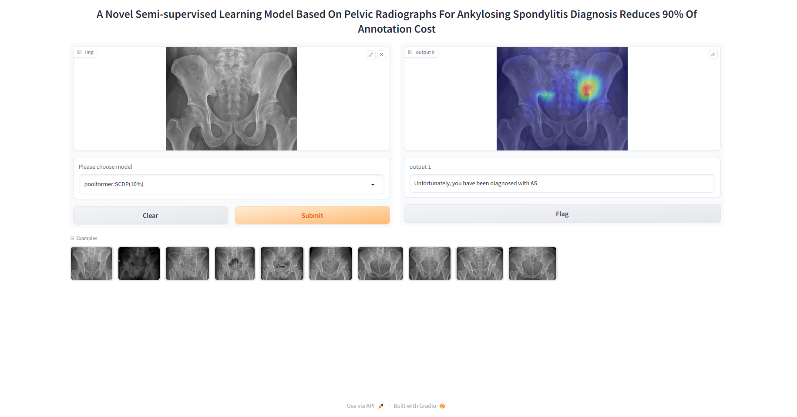
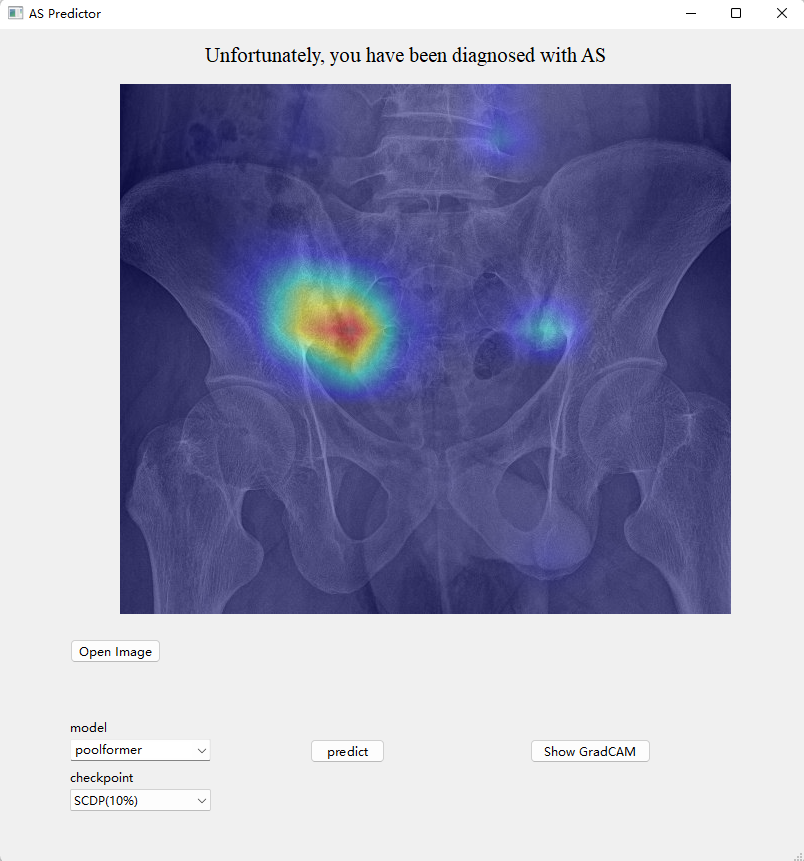

# A Novel Semi-supervised Learning Model Based On Pelvic Radiographs For Ankylosing Spondylitis Diagnosis Reduces 90\% Of Annotation Cost

This is a README file for the Paper: "A Novel Semi-supervised Learning Model Based On Pelvic Radiographs For Ankylosing Spondylitis Diagnosis Reduces 90\% Of Annotation Cost."

## Description

The Project is a web application and a local application built with Python 3.7. It provides a user-friendly interface for performing specific tasks.

## Requirements

- Python 3.7
- Dependencies listed in requirements.txt

## Installation

1. Create a virtual environment using Python 3.7.
2. Activate the virtual environment.
3. Install the required dependencies by running the following command:
   ```
   pip install -r requirements.txt
   ```


## Usage

### Gradio Web Application

1. Double-click the 'start_gradio.bat' file to run the Gradio version of the web application.
2. Once the application is running, copy the local network URL provided in the console.
3. Paste the URL into a web browser to access and use the application.




### PySide6 Local Application

1. Double-click the 'start_pyside.bat' file to run the PySide6 version of the local application.
2. The application will launch and display the user interface.



## Note

Please note that the model weights file is not included in this code repository due to its large size. If you require the model weights, please contact the author for further assistance.

For any issues or inquiries, please contact [Hao Li](mailto:675853612@qq.com).
